<div align="center">


# FaultSegV3

### Less Is More in Seismic Fault Segmentation


[](framework/FaultSegV3.py)
[](#architecture)
[](framework/faultsegv3.ckpt)
[](https://modelscope.cn/datasets/douyimin/CIG-Bench-Dataset)

**English** · [简体中文](README.zh-CN.md)

[Discoveries](#discoveries) · [Results](#results) · [Architecture](#architecture) · [Quick start](#quick-start) · [Training](#training) · [Citation](#citation)

Yimin Dou · Xinming Wu · Xiaoming Sun · Runsong Yu  
University of Science and Technology of China

</div>

---

FaultSegV3 investigates a basic question: **what do seismic fault segmentation networks actually need to learn?** Our experiments suggest that preserving local reflection discontinuities, terminations, and offsets can matter more than adding training volumes or increasing model capacity. Guided by this finding, FaultSegV3 combines a high-resolution 3D backbone with limited downsampling, strong augmentation, and a shallow decoder.

| Compact model | Limited spatial compression | Best benchmark performance with synthetic training | Synthetic-to-field transfer |
| :---: | :---: | :---: | :---: |
| **0.563 M** parameters | **1** main-path downsampling | **0.7376** mean Tol-IoU@2 | **No field training data** |

> **The contribution goes beyond a small network:** data- and capacity-scaling experiments motivate a local-feature hypothesis, the architecture tests its practical value, and curated field labels enable a shared quantitative comparison.

<p align="center">
  <a href="docs/assets/study-overview.jpg">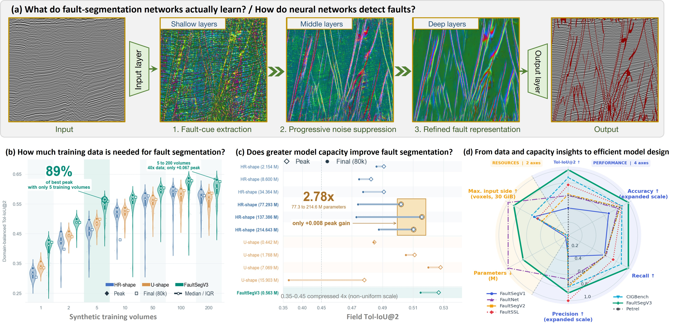</a>
  <br><sub>From shallow fault responses to data sufficiency, capacity saturation, and efficient design. Click any figure for the full-resolution image.</sub>
</p>

## Discoveries

### 1. Very little synthetic data can already support field generalization

Training on just **two 128³ synthetic volumes** already delineates major faults in field surveys. With five volumes, FaultSegV3 reaches a best domain-balanced Tol-IoU@2 of **0.5647**, approximately **89%** of its highest observed peak (**0.6365**) in the data-scaling experiment. Moving from five to 200 volumes uses **40×** as much source data for an absolute gain of **0.0668**.

<p align="center">
  <a href="docs/assets/few-volume-generalization.jpg">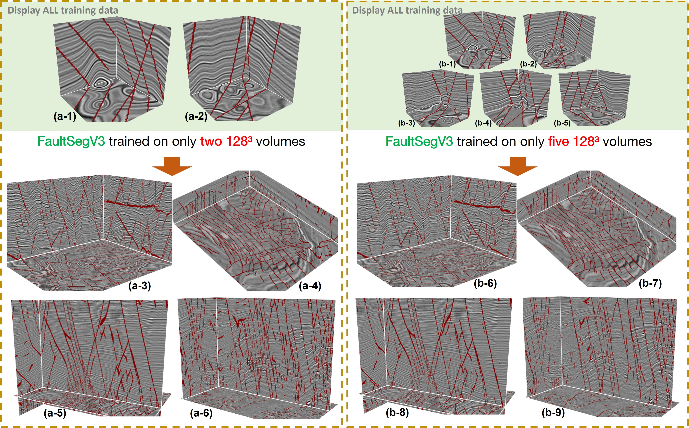</a>
  <br><sub>Every source volume is shown. The lower panels are field predictions, not training examples. These qualitative examples use parameter-EMA checkpoints at 80,000 updates.</sub>
</p>

**Interpretation:** repeated sampling from the same synthetic generator has diminishing returns. This does not rule out the value of new geological diversity. The two-volume experiment is separate from the final pretrained-method comparison below.

### 2. More capacity does not guarantee better fault segmentation

Increasing HRNet capacity from **77.3 M to 214.6 M parameters**—a **2.78×** increase—adds only about **0.008** to peak field Tol-IoU@2 under the paper's score-smoothing protocol. Wider models can also lose more performance during continued training.

### 3. Fine spatial evidence is a useful design priority

Fault responses are already visible in shallow features. Deeper layers appear to suppress nonfault responses and refine continuity. FaultSegV3 preserves those early cues through a full-resolution skip path and persistent high-resolution processing, while an auxiliary stream supplies context.

**Scope of the finding:** these observations support a design hypothesis under the tested voxel-wise discriminative setting. They do not prove that global geological context is unnecessary or that smaller models always win.

<details>
<summary><b>Explore the data- and capacity-scaling experiments</b></summary>

**Training-set size: 1, 2, 5, 10, 50, 100, and 200 synthetic volumes.** The combined score gives equal weight to the synthetic-domain mean and the field-domain mean.

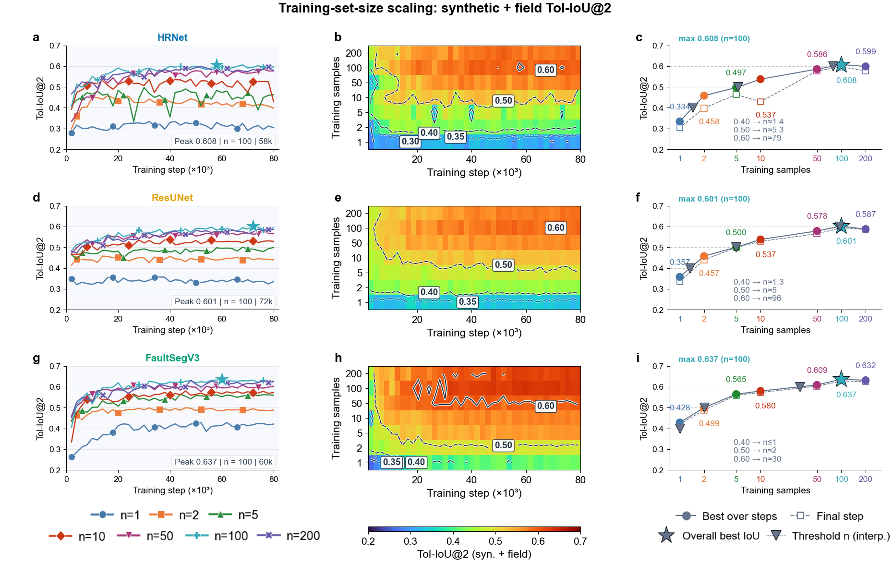

**Capacity and training dynamics.** Curves use the mean across F3, USGS1, and USGS2 with score-curve EMA smoothing (α = 0.25); this is different from averaging model weights.

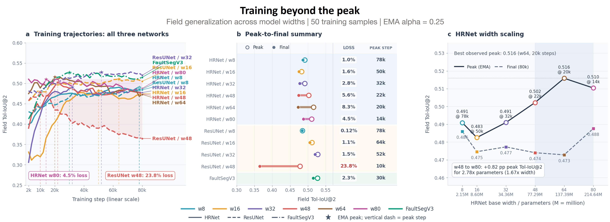

</details>

## Results

### Performance highlights

The manuscript reports performance as the **arithmetic mean over five evaluation volumes**: two synthetic volumes, USGS1, USGS2, and the F3 evaluation volume **without polygonal faults**. Every volume has weight 1/5.

Compared with the CIG-Bench predictor, FaultSegV3 achieves **+0.0886 Tol-IoU@2 (+13.7% relative)** with approximately **61× fewer parameters** and **73% fewer standard-forward MACs**. It leads mean Tol-IoU@2, accuracy, and recall among the evaluated methods; FaultSSL has the highest precision, and FaultNet has the lowest resource cost.

<details>
<summary><b>Evaluation protocol and how to read these numbers</b></summary>

- **Tolerance-based metrics.** Predictions are thresholded at 0.5. Matching uses a 3D Euclidean radius of two voxels (33 integer offsets). Precision and recall count matched prediction and label voxels separately. Tol-IoU@2 is computed as `F1 / (2 − F1)` from tolerance-based F1; it is not strict voxel Jaccard overlap. Accuracy also uses tolerance-matched counts.
- **Training data.** FaultSegV3 in the final comparison is trained on 200 FaultSegV1 synthetic volumes plus CIG-Bench `struc_00.npz`, with no field training data. Baselines use their available pretrained checkpoints, so the comparison evaluates methods and checkpoints rather than isolated architectures under identical retraining.
- **Compute.** MACs count convolutions and transposed convolutions for a 128³ input through the ordinary forward path; one MAC equals two FLOPs. These values are not wall-clock timings.
- **Input capacity.** Tested cubes are batch-one FP16 inference limits on a 16-voxel side-length grid under a 30 GiB PyTorch allocator budget. FaultSegV3 uses internal rank-4 operator chunking with chunk size 64. Preprocessing, metrics, and CUDA-context overhead are excluded. This is not a training-memory guarantee or a uniform FP16 reevaluation of accuracy.
- **Distinct protocols.** The scaling experiments balance synthetic and field domains equally. The final method comparison weights five volumes equally. Their scores should not be compared as the same aggregate.

</details>

### Field examples: fine traces and closely spaced faults

**F3 polygonal faults.** FaultSegV3 resolves a denser network of fine traces in the additional horizontal view.

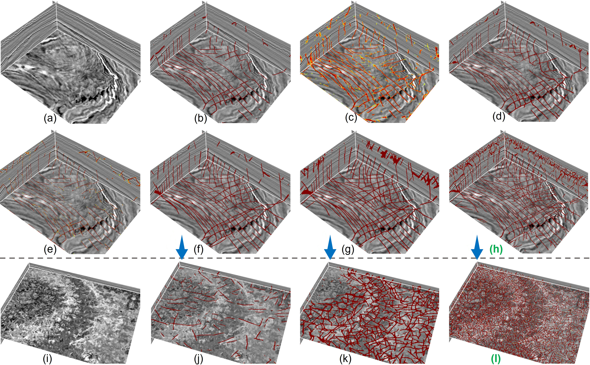

**Panel guide:** (a, i) seismic; (b) Petrel; (c) FaultSegV1; (d) FaultNet; (e) FaultSegV2; (f, j) FaultSSL; (g, k) CIG-Bench; **(h, l) FaultSegV3**. The F3 polygonal-fault volume above is used **only for qualitative comparison** and is distinct from the quantitative F3 volume.

<details>
<summary><b>USGS1 · branching faults and finer connections</b></summary>

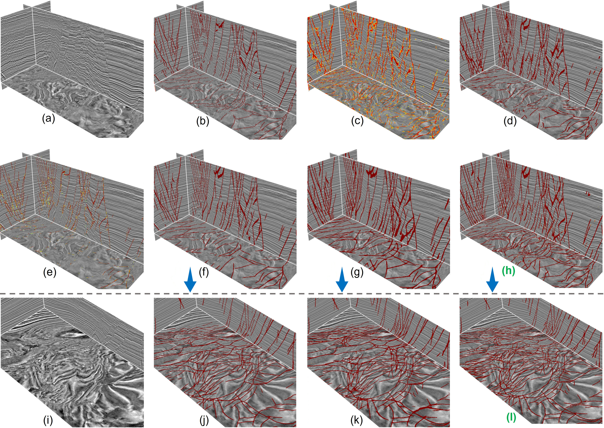

</details>

<details>
<summary><b>USGS2 · fault coverage through a disrupted reflection interval</b></summary>

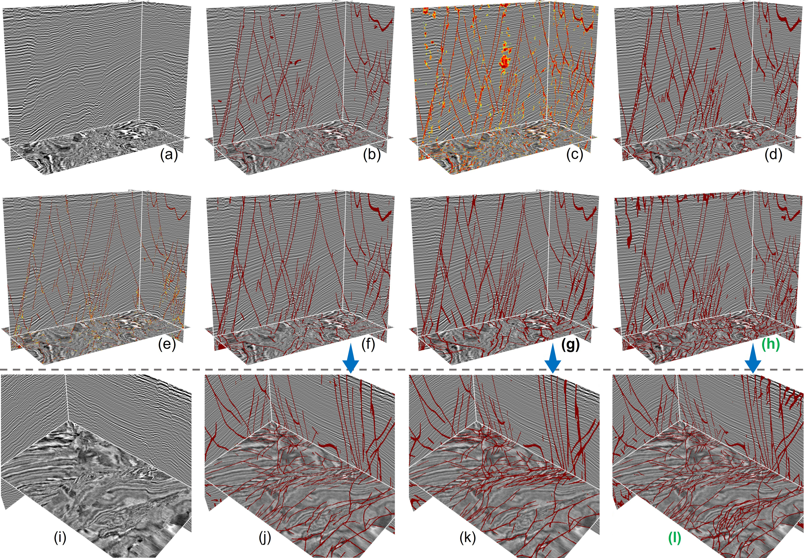

</details>

<details>
<summary><b>USGS3 · dense, intersecting fault traces</b></summary>

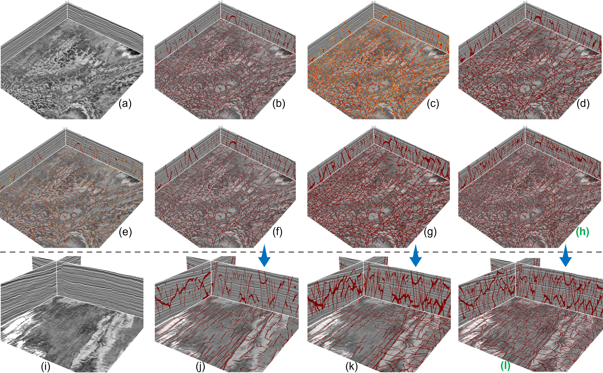

</details>

<details>
<summary><b>NLOG · dominant faults and short intervening traces</b></summary>

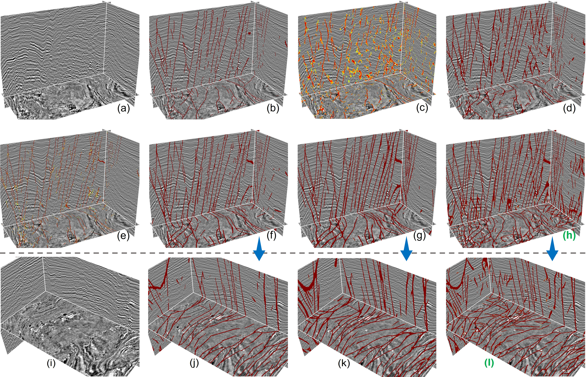

</details>

All field comparisons use the same panel arrangement. USGS3 and NLOG are qualitative only. The figures illustrate continuity, coverage, and response thickness; denser predictions alone do not establish that every connection is a true fault.

## Architecture

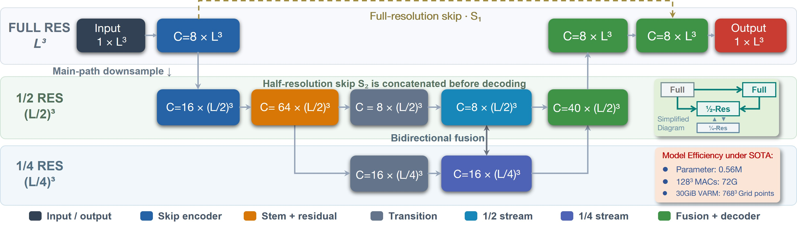

| Design | Implementation | Purpose |
| :--- | :--- | :--- |
| Preserve fine detail | Full-resolution skip features; one downsampling operation on the main path | Retain weak discontinuities, terminations, and small offsets |
| Add context without deep compression | Half-resolution stream with `c = 8`; auxiliary quarter-resolution stream with `2c = 16` | Help distinguish faults from noise and nonfault amplitude edges |
| Exchange information repeatedly | Six bidirectional fusion modules, four residual blocks per stream in each module | Refine local evidence with surrounding context |
| Keep decoding shallow | One restoration step to full resolution with skip fusion | Recover thin structures from preserved spatial features |
| Encourage transfer | Online geometric and amplitude augmentation; Drop Path up to 0.1 | Reduce dependence on source-specific appearance |

The auxiliary quarter-resolution branch has its own downsampling; **“one downsampling” refers to the main feature path**. The `c=8` implementation contains **562,625 trainable parameters**.

Inference additionally offers **operator chunking (`rank=0…4`)** and automatic spatial tiling on memory exhaustion. Here, `rank` selects a memory-optimization level; it is unrelated to tensor rank or distributed-process rank.

## Quick start

### Install

Use a Python environment with PyTorch; **Python 3.10+ is recommended**. Install a PyTorch build appropriate for your hardware from [pytorch.org](https://pytorch.org/get-started/locally/).

```bash
git clone https://github.com/douyimin/FaultSegV3.git
cd FaultSegV3

# Core inference dependencies
python -m pip install torch numpy

# Automatic data download and interactive 3D visualization
python -m pip install modelscope cigvis PyQt5

# Additional dependencies for training
python -m pip install torchvision pytorch-lightning kornia matplotlib tensorboard
```

Match `torchvision` to your PyTorch installation when training. Interactive visualization needs a working desktop/OpenGL environment; file-based inference can run without the visualization packages. The pretrained checkpoint is included at [`framework/faultsegv3.ckpt`](framework/faultsegv3.ckpt).

### Run the F3 demo

```bash
python inference.py
```

The demo downloads/caches `FaultMetricData/F3-GT.npz` from [ModelScope](https://modelscope.cn/datasets/douyimin/CIG-Bench-Dataset), reads `seis_polyfault`, runs inference at **2× scale on all axes**, restores the original shape, saves `F3-GT-faultsegv3-prediction.npz`, and opens an interactive seismic/prediction view. Upscaling increases memory use; a CUDA GPU is recommended for this demo.

### Predict your own volume

Input is a finite, numeric 3D NumPy array with axis order **`(t, h, w)`**: time/depth first, followed by the two lateral axes. Supported files are `.npy` and `.npz`.

```bash
# File-based inference; no GUI is opened
python inference.py seismic.npy prediction.npz --resize-back

# Choose the array inside an NPZ and display the result
python inference.py survey.npz prediction.npz --input-key seis --resize-back --visualize

# CPU inference for a small volume
python inference.py seismic.npy prediction.npz --device cpu --resize-back
```

The output NPZ contains `prediction` and `input`. By default, **values at or below 0.5 are zeroed; retained values remain probabilities**, not binary labels. Use `--threshold 0` to retain the full nonnegative probability map. `--resize-back` restores the prediction to the original input shape; otherwise dimensions are resampled to multiples of 16.

### Python API

```python
import numpy as np
from inference import FaultPredictor

seismic = np.load("seismic.npy")  # (t, h, w)
predictor = FaultPredictor(device="cuda")
probability, used_seismic = predictor.predict(
    seismic,
    threshold=0.0,
    resize_back=True,
    rank=4,
    chunk_size=64,
)
fault_mask = probability > 0.5
np.savez_compressed("prediction.npz", prediction=probability, fault=fault_mask)

# Optional desktop visualization
# predictor.visualize(used_seismic, probability)
```

<details>
<summary><b>Memory controls and inference options</b></summary>

| Option | Default | Meaning |
| :--- | :--- | :--- |
| `--weights` | `framework/faultsegv3.ckpt` | Local model weights |
| `--device` | `cuda` | CUDA device or CPU; falls back to CPU when CUDA is unavailable |
| `--rank` | `4` | `0`: ordinary forward; `1–4`: increasing operator-level memory optimization |
| `--chunk-size` | `64` | Internal operator chunk size |
| `--scale` | `1.0` | Uniform resampling; a non-unit value overrides per-axis scales |
| `--scale-t / --scale-h / --scale-w` | `1.0` | Per-axis resampling |
| `--resize-back` | Off | Restore the original shape using nearest-neighbor interpolation |
| `--gpu-memory-fraction` | `0.9` | Memory guard budget relative to initially free GPU memory |
| `--fallback-halo` | `16` | Context overlap around fallback spatial tiles |
| `--no-oom-fallback` | Off | Disable automatic retry with spatial tiles |

The fallback splits the lateral axes while retaining the full time/depth axis. Each tile is normalized locally, so tiled results can differ from full-volume inference near boundaries. The memory guard can trigger a retry after a forward pass; it does not reserve a hard GPU memory quota.

```bash
python inference.py seismic.npy prediction.npz --rank 4 --chunk-size 32 --resize-back
python inference.py --help
```

</details>

## Training

The training pipeline provides automatic dataset preparation, per-batch multiscale sampling, augmentation after device transfer, Dice loss, AdamW, cosine learning-rate decay, optional EMA, and resumable Lightning checkpoints.

```bash
# Download and extract FaultSegV1 only
python train.py --dataset v1 --data-root ./data --prepare-only

# Fine-tune from the included weights with an explicit, smaller batch
python train.py --dataset v1 --data-root ./data --size 2 128 128 128 --workers 0

# Train from random initialization
python train.py --dataset v1 --data-root ./data --no-weights --size 2 128 128 128 --workers 0

# Use multiple crop sizes, each with its own batch size
python train.py --dataset all --data-root ./data --size 2 128 128 128 --size 1 256 176 176 --workers 0

# Restore optimizer, scheduler, and training state
python train.py --dataset v1 --data-root ./data --resume model_weights/last.ckpt --size 2 128 128 128 --workers 0
```

`--size` takes **`BATCH D H W`** and can be repeated. Choose batch sizes for your GPU. `--workers 0` is a simple starting point; increase it to improve loading throughput. Dataset choices are `v1`, `v2`, and `all` (V1 + V2). Training NPZ files contain paired `seis` and `fault` arrays.

| Setting | Current script default |
| :--- | :--- |
| Initialization | Included pretrained weights; use `--no-weights` for a fresh model |
| Optimizer / loss | AdamW / masked Dice |
| Learning rate | `1e-4 → 5e-6`, cosine endpoint at 100,000 steps |
| Precision | `bf16-mixed` |
| EMA | Enabled, decay `0.9996`; disable with `--no-ema` |
| Checkpoints | Every 2,500 steps in `model_weights/` |
| Logging / previews | TensorBoard in `logs/`; training previews in `results/` |

**Reproducing the manuscript:** the convenient defaults above are not the exact paper protocol. Scaling experiments use selected FaultSegV1 subsets, random initialization, 80,000 updates, and ordinary checkpoints for quantitative evaluation. The final comparison uses 200 FaultSegV1 volumes plus `struc_00.npz`, whereas `--dataset all` loads V1 + V2. This snapshot does not include the full scaling/baseline evaluation runner or a CLI step limit; set the required subset and `Trainer(max_steps=80000)` in a reproduction run. `--cosine-steps` controls decay, not when training stops. The script currently sets `CUDA_VISIBLE_DEVICES="0,1"` internally; edit that assignment to change visible GPUs.

## Data and field reference labels

Data are hosted in the [CIG-Bench dataset on ModelScope](https://modelscope.cn/datasets/douyimin/CIG-Bench-Dataset). The code automatically prepares `ClassicDatasets/FaultSegV1.zip` and/or `ClassicDatasets/FaultSegV2.zip`, reusing local caches when available.

The manuscript introduces curated reference labels for **F3, USGS1, and USGS2** through the following workflow:

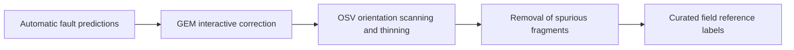

These labels provide a common basis for quantitative evaluation across methods. For the synthetic test volumes described in the manuscript, read the **`seis_noised`** array; the interactive F3 demo instead reads **`seis_polyfault`**. See [asset provenance](docs/assets/README.md) for the mapping between README figures and manuscript figures.

## Repository map

```text
FaultSegV3/
├── inference.py                 # Local weights, prediction, memory fallback, 3D demo
├── train.py                     # Dataset preparation and Lightning training entry point
├── framework/
│   ├── FaultSegV3.py            # High-resolution backbone and chunked inference
│   ├── framework.py             # Lightning module, loss, and optimizer
│   ├── custom_callback.py       # EMA, weight export, and training previews
│   └── faultsegv3.ckpt          # Included pretrained model
├── seisDataset/
│   ├── dataset.py              # Download/cache, paired loading, multiscale batching
│   └── gpu_aug.py              # Geometric and amplitude augmentation
├── docs/assets/                 # README banner and original manuscript figures
├── README.zh-CN.md              # Chinese documentation
└── LICENSE-CIG-Bench            # License for adapted CIG-Bench portions
```

## Citation

If this work supports your research, please cite the manuscript. The entry below intentionally omits unverified journal, DOI, and publication metadata.

```bibtex
@misc{dou_faultsegv3,
  title  = {{FaultSegV3}: Less Is More in Seismic Fault Segmentation},
  author = {Dou, Yimin and Wu, Xinming and Sun, Xiaoming and Yu, Runsong},
  note   = {Manuscript},
  url    = {https://github.com/douyimin/FaultSegV3}
}
```

Correspondence: [Yimin Dou](mailto:douyimin@ustc.edu.cn) · [Xinming Wu](mailto:xinmwu@ustc.edu.cn).

**Acknowledgments.** This work builds on FaultSeg3D/FaultSegV1, FaultSeg3D+/FaultSegV2, HRNet, FaultNet, FaultSSL, CIG-Bench, GEM, OSV, and the public seismic surveys used in the study. Visualization uses [cigvis](https://github.com/JintaoLee-Roger/cigvis). Adapted CIG-Bench inference portions are covered by [`LICENSE-CIG-Bench`](LICENSE-CIG-Bench); that notice applies to those portions and is not a repository-wide license declaration.
